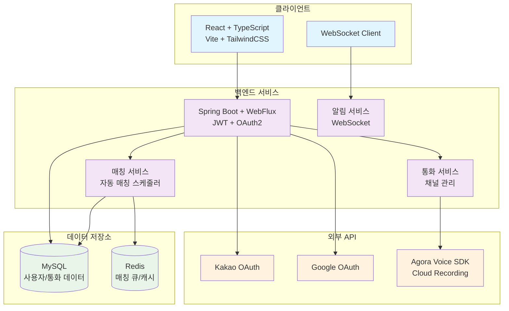

# 🎯 친구하자 (Chingoo Haja)
> 관심사 기반 실시간 음성 매칭 플랫폼

관심사가 비슷한 사람들을 자동으로 매칭해주는 실시간 음성 통화 서비스입니다.  
Spring Boot 백엔드와 React 프론트엔드로 구성된 모던 웹 애플리케이션입니다.

## 🌟 주요 기능

- **🔄 실시간 자동 매칭**: 관심사 기반 사용자 매칭 시스템
- **📞 음성 통화**: Agora 기반 고품질 음성 통화
- **🎙️ 자동 녹음**: 클라우드 기반 통화 내용 자동 녹음
- **🔐 소셜 로그인**: 카카오/구글 OAuth 2.0 인증
- **👥 친구 시스템**: 통화 후 친구 관계 형성 지원
- **⭐ 평가 시스템**: 통화 품질 및 사용자 피드백

## 🏛️ 시스템 아키텍처

## 🛠️ 기술 스택

### 프론트엔드
- **React 18** + **TypeScript** - 모던 웹 개발
- **Vite** - 빠른 개발 환경
- **TailwindCSS** + **shadcn/ui** - 모던 UI/UX
- **React Query** - 서버 상태 관리
- **WebSocket** - 실시간 알림

### 백엔드  
- **Spring Boot 3.x** + **WebFlux** - 반응형 웹 서버
- **Spring Security** + **JWT** - 보안 인증
- **JPA** + **MySQL** - 데이터 영속성
- **Redis** - 매칭 큐 및 캐시
- **WebSocket** - 실시간 통신

### 외부 서비스
- **Agora Voice SDK** - 음성 통화 및 녹음
- **OAuth 2.0** - 카카오/구글 소셜 로그인
- **Docker** - 개발 환경 컨테이너화

## 🚀 주요 특징

### 🎯 스마트 매칭 시스템
- Redis 기반 실시간 매칭 큐 관리
- 관심사별 자동 사용자 페어링
- 빠른 매칭으로 즉시 연결

### 📞 고품질 음성 서비스
- Agora SDK 기반 저지연 음성 통화
- 자동 클라우드 녹음 및 저장
- 네트워크 상태에 따른 품질 최적화

### 🔐 보안 및 인증
- OAuth 2.0 PKCE 방식 소셜 로그인
- JWT 기반 무상태 인증
- Spring Security 다중 보안 계층

### ⚡ 실시간 경험
- WebSocket 기반 즉시 알림
- 매칭 상태 실시간 업데이트
- 반응형 UI/UX 인터랙션

## 📊 시스템 특징

- **빠른 매칭**: 관심사 기반 즉시 연결
- **고품질 음성**: 48kHz 고품질 오디오
- **안정적 운영**: 높은 가용성 목표
- **확장 가능**: 클라우드 기반 인프라

## 🔒 보안 정책

이 프로젝트는 상용 서비스를 목표로 하며, 다음 보안 정책을 준수합니다:

- 🔐 모든 API 키 및 비밀키는 환경변수로 관리
- 🛡️ 개인정보 보호법 준수 데이터 처리
- 🔍 코드 리뷰 및 보안 감사 시행
- 📝 상세 구현 내용은 비공개 저장소에서 관리
- 🎙️ 녹음 데이터 처리 관련 법적 동의 절차 준수

## 📞 문의

- **버그 리포트**: GitHub Issues
- **기능 제안**: GitHub Discussions

---

> 💡 본 프로젝트는 포트폴리오 목적과 실제 서비스 런칭을 목표로 개발되고 있습니다.
> [🩷 개발 일지](https://nan0silver.github.io/projectdiary/)

© 2026 친구하자. All rights reserved.
